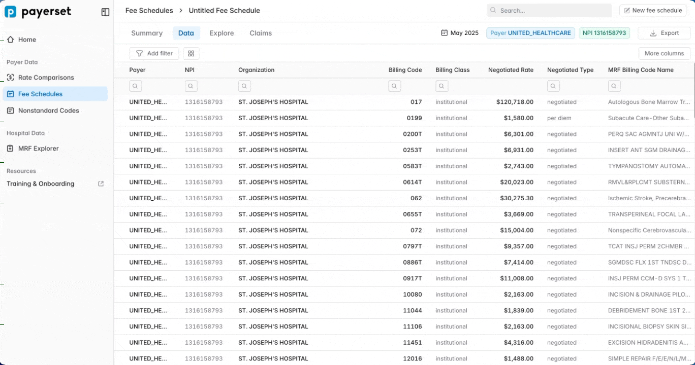

# 🟡 UnitedHealthcare

### Payerset Notes

**Table of Contents**

[https://mrf.payerset.com/united-healthcare](https://mrf.payerset.com/united-healthcare)

### Compliance Scorecard

Overall Rating: <mark style="color:yellow;">**4/5**</mark>** - Good**

<table data-view="cards"><thead><tr><th></th><th></th><th></th><th></th><th data-hidden data-card-cover data-type="files"></th></tr></thead><tbody><tr><td><strong>Table of Contents</strong></td><td><strong>★★★☆☆</strong></td><td><mark style="color:orange;"><strong>3/5</strong></mark></td><td><ul><li>Are the MRFs kept up to date each month? </li><li><mark style="color:red;">Is the Table of Contents link easily accessible?</mark></li><li>Is the Table of Contents properly formatted?</li></ul></td><td></td></tr><tr><td><strong>File Accessibility</strong></td><td><strong>★★★★★</strong></td><td><mark style="color:green;"><strong>5/5</strong></mark></td><td><ul><li>Are there any barriers to downloading the files?</li><li>Do the Table of Contents links expire before publishing new links?</li></ul></td><td></td></tr><tr><td><strong>Data Quality</strong></td><td><strong>★★★★★</strong></td><td><mark style="color:yellow;"><strong>4/5</strong></mark></td><td><ul><li>
What percentage of the MRFs are properly formatted and parseable
<ul><li>5 Stars - 100%</li><li>4 Stars - 80%...</li></ul></li></ul></td><td></td></tr></tbody></table>

### Schema: UNITED\_HEALTHCARE

**Rates Records**: 1,950,186,881,312

**Provider Records**: 9,177,047,285

### Additional Observations

**Machine-Readable Price Transparency Files Review**

* **MRFs Up-to-Date:** ✔️ Yes, the MRFs are kept up to date each month.
* **Table of Contents Accessibility:** ❌ The Table of Contents link is not easily accessible, it spans thousands of individual files that must be downloaded in multiple steps.
* **Table of Contents Formatting:** ✔️ Yes, the Table of Contents is properly formatted once downloaded.
* **File Download Barriers:** ✔️ No, there are no barriers to downloading the files.
* **File Accessibility Percentage:** 99.9% of the files are accessible.

#### Data Quality Issues

UnitedHealthcare publishes many MS-DRG codes with 4 digits, including a leading zero, causing them to be out of compliance in that regard (though we should assume this is not intentional). Additionally, many rates that are supposed to be tagged as `institutional` are instead tagged as `professional` which leads to confusing results. These issues must be fixed to get the maximum value out of this data for UnitedHealthcare.

One interesting thing about UnitedHealthcare that we don't see in other payers is that they sometimes put multiple billing codes in the `billing_code` field. See the example below in which they put  `29888 AND 29882` in the same field. We do not know the reason for this, but don't believe it is in compliance.

<figure><figcaption></figcaption></figure>

**Overall Assessment:** Despite the very large volumes and questionable interpretation of the assignment, Aetna consistently puts out accessible, properly-formatted files with complete data.
